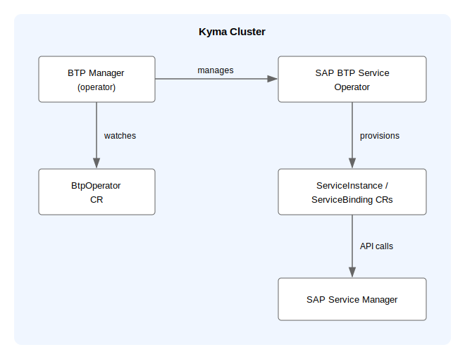

# BTP Manager Architecture

BTP Manager is a Kubernetes operator built on the [Kubebuilder](https://github.com/kubernetes-sigs/kubebuilder) framework. It manages the lifecycle of the SAP BTP service operator inside a Kyma cluster.

## Components

## BTP Manager

BTP Manager runs as a controller in the `kyma-system` namespace. It watches the BtpOperator custom resource (CR) and reconciles the full lifecycle of the SAP BTP service operator — provisioning, updating, and deprovisioning.

On each reconciliation, BTP Manager reads credentials from the `sap-btp-manager` Secret (delivered to the cluster by Kyma Environment Broker (KEB)), applies or removes manifests from the `module-resources` directory, and sets the BtpOperator CR status to reflect the current state (`Ready`, `Processing`, `Error`, `Deleting`, or `Warning`).

For the full list of CR states and condition reasons, see [BTP Manager Operations](./02-10-operations.md).

## SAP BTP Service Operator

The SAP BTP service operator is installed and managed by BTP Manager. It extends the cluster API with two CRDs — `ServiceInstance` and `ServiceBinding` — from the `services.cloud.sap.com` API group. It communicates with SAP Service Manager over OSB API to provision and bind SAP BTP services.

## BtpOperator Custom Resource

The `BtpOperator` CR (`operator.kyma-project.io/v1alpha1`) is the reconciliation trigger. Only one valid CR is allowed per cluster: it must be named `btpoperator` and reside in the `kyma-system` namespace. Any other CR is set to the `Warning` state with the reason `WrongNamespaceOrName`.

## sap-btp-manager Secret

The `sap-btp-manager` Secret in the `kyma-system` namespace carries the SAP Service Manager credentials required for provisioning: `clientid`, `clientsecret`, `sm_url`, `tokenurl`, and `cluster_id`. It is delivered by KEB on Kyma runtime creation. BTP Manager reads this Secret and injects the credentials into the `sap-btp-service-operator` Secret, which the SAP BTP service operator uses to authenticate with SAP Service Manager. For details on the Secret format and customization options, see [Preconfigured Secret](../user/03-10-preconfigured-secret.md). If the Secret is absent or incomplete, reconciliation is blocked until it is provided.

## Related Information

- [BTP Manager Operations](./02-10-operations.md)
- [BTP Manager Configuration](./01-20-configuration.md)
- [BtpOperator Custom Resource](../user/resources/02-10-sap-btp-operator-cr.md)
