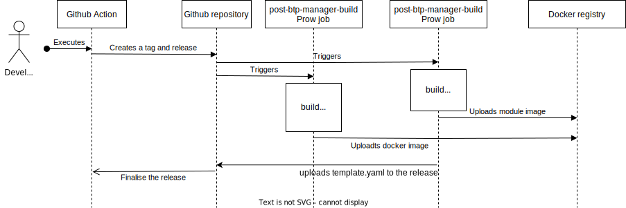

# BTP Manager release pipeline

## Overview

The BTP Manager release pipeline creates proper artifacts:
 - btp-operator module OCI image in the [registry](https://console.cloud.google.com/artifacts/docker/kyma-project/europe/prod/btp-manager)
 - btp-manager Docker image in the [registry](https://console.cloud.google.com/artifacts/docker/kyma-project/europe/prod/unsigned%2Fcomponent-descriptors%2Fkyma.project.io%2Fmodule%2Fbtp-operator)
 - `template.yaml`, `template_control_plane.yaml`, `btp-manager.yaml`, `btp-btp-operator-default-cr.yaml`

## Run the pipeline

### Create a release

To create a release, follow these steps:

1. Run GitHub action **Create release**:  
   i.  go to the **Actions** tab  
   ii. click on **Create release** workflow   
   iii. click  **Run workflow** on the right  
   iv. provide a version, for example, 1.2.0  
   v. choose real or dummy credentials for Service Manager  
   vi. choose whether to bump or not to bump the security scanner config
2. The GitHub action, defined in the [`create-release.yaml`](/.github/workflows/create-release.yaml) file, validates the release by checking if the GitHub tag already exists, if there are any old Docker images for that GitHub tag, and if merged PRs that will be part of this release are labeled correctly.
3. If you chose in step 1.vi to bump the security scanner config, the GitHub action creates a PR with a new security scanner config that includes the new GitHub tag version.
4. A code owner approves the PR. 
5. The GitHub action creates a GitHub tag and draft release with the provided name.
6. The GitHub action asynchronously initiates unit tests and an await for Prow Jobs status.
7. The tag creation triggers Prow Jobs, `post-btp-manager-module-build` and `post-btp-manager-build`, defined in [`btp-manager-build.yaml`](https://github.com/kyma-project/test-infra/blob/main/prow/jobs/kyma-project/btp-manager/btp-manager-build.yaml).
8. `post-btp-manager-build` builds a Docker image tagged with the release name.
9. `post-btp-manager-module-build` runs the `kyma alpha create module` command, which creates a Kyma module and pushes the image to the registry. Kyma CLI is called with the `--sec-scanners-config` flag and uses a dynamically created file to configure security scanning settings in the module template. Finally, the job uploads the `template.yaml`,`template_control_plane.yaml`, `btp-manager.yaml` and `btp-operator-default-cr.yaml` files to the btp-manager release as release assets.
10. The GitHub action asynchronously initiates stress tests jobs and E2E tests jobs upon Prow job success status. E2E upgrade tests run only with real credentials for Service Manager.
11. The GitHub action waits for the `template.yaml` asset in the GitHub release and for images in the Docker registry.
12. The GitHub action fetches the module image and runs E2E tests on the k3s cluster with the specified credentials. 
13. If the unit tests, stress tests and E2E tests are completed successfully, the GitHub action publishes the release.

### Replace an existing release

To regenerate an existing release, perform the following steps:

1. Delete the GitHub release.
2. Delete the GitHub tag.
3. Run the [**Create release**](#create-a-release) pipeline. 
