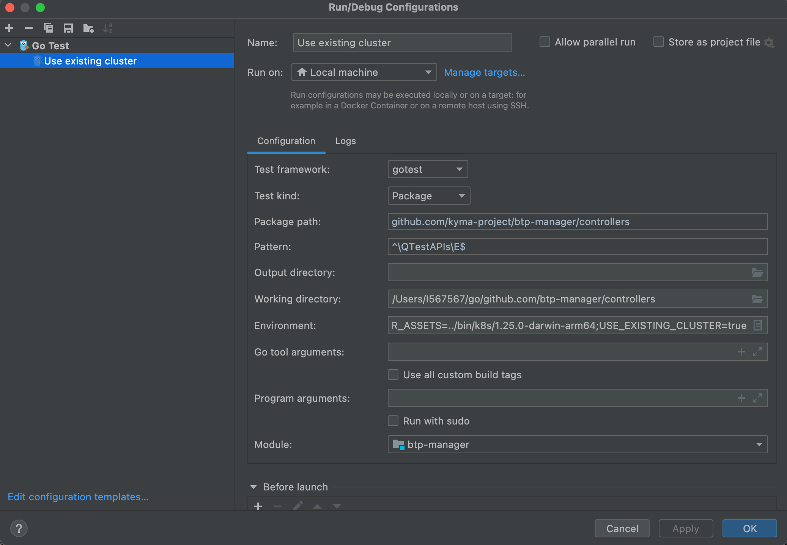
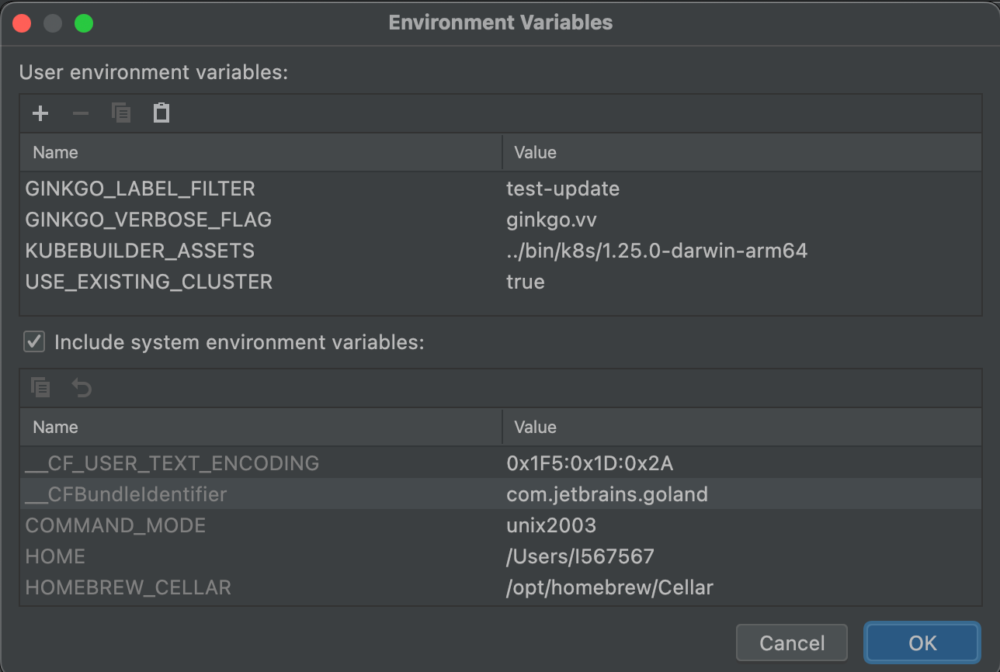

# Run Unit Tests

## Run Unit Tests Using Command Line Interface 

To run the unit tests from the command line, use the following command from the BTP Manager main directory: 

```shell
make test
```
The details concerning the `test` rule (prerequisites and recipe) are defined in [`Makefile`](../../Makefile).

By default, the unit tests are run using the envtest cluster. 
Some of the unit tests are implemented using the [Gingko](https://onsi.github.io/ginkgo/#top) library, but all of them are invoked using the `go test ./... <some options>`.
You can find the exact invocation reflected in the console output along with messages confirming whether the envtest is used.

```
STEP: bootstrapping test environment @ 01/13/23 08:24:45.981
2023-01-13T08:24:45.981+0100  DEBUG   controller-runtime.test-env     starting control plane
```

### Run Unit Tests on Existing Cluster

To run the tests on an existing cluster (not the envtest cluster), set the value of the environment variable **USE_EXISTING_CLUSTER** to `true`.

```shell
USE_EXISTING_CLUSTER=true make test
```

> [!NOTE] 
> The test suite assumes the proper state of the cluster before running. If problems with left-over resources occur, you can recreate the cluster or remove resources manually.

### Test Output Verbosity

The setting for the `go test` verbosity is `-v` (verbose, print the full output event for passing tests). This can be changed in the `make` recipe. 
For the `Ginkgo` tests execution, the default setting is `-ginkgo.v` (verbose). It can be changed, for example, for `very verbose` by setting the environment variable **GINKGO_VERBOSE_FLAG**.
The allowed values are: `ginkgo.succinct`, `ginkgo.v`, or `ginkgo.vv`. Accordingly, the output level is: succinct, verbose, or very verbose.

```shell
GINKGO_VERBOSE_FLAG="ginkgo.vv" make test
```

### Filtering Labels

To filter which tests specs are to be executed, use the Ginkgo library labeling features. 
For more details, see [Spec Labels](https://onsi.github.io/ginkgo/#spec-labels) in Ginkgo documentation. 
To use labels for filtering, you must instrument the test Nodes (`Describe`, `It`, `When` et al.) in the [BtpOperator-controller `test.go`](../../controllers) files with labels, for example:

```go
	Describe("Provisioning", Label("test-provisioning", "smoke-test"), func() {
```
```go
	Describe("Deprovisioning", Label("test-deprovisioning"), func() {
```

To use labels, set the **GINKGO_LABEL_FILTER** variable. For example, run only the specs labeled as `smoke-test`:

```shell
GINKGO_LABEL_FILTER="smoke-test" make test
```

Here is another example of a simple expression:

```shell
GINKGO_LABEL_FILTER="test-provisioning,test-deprovisioning" make test
```

### Environment Variables

You can also set all the above-mentioned environment variables in the [set-env-vars.sh](../../scripts/testing/set-env-vars.sh) file. The script sets the default values for all the environment variables used in the `go test` invocation. 
Changing the script contents is recommended if a more complex filtering expression is required, or if you frequently reuse the setting. 
However, you should not push the changes without considering how this affects GitHub Actions workflows.

## Run Test Suite with IDE

You can define environment variables in Run Configuration, run tests, change logs verbosity and use filtering features on an existing cluster.





