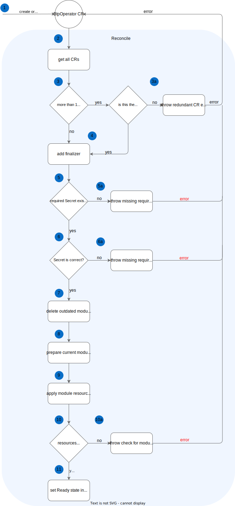
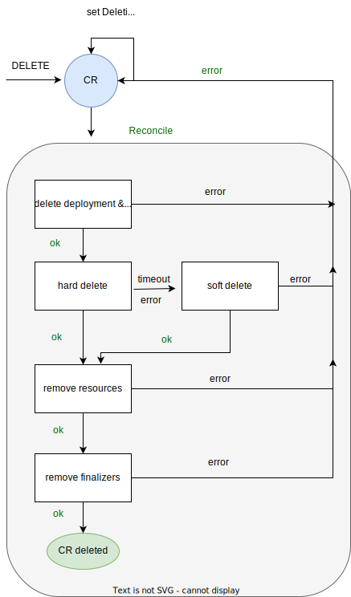

| title                  |
|------------------------|
| BTP Manager Operations |

## Overview

BTP Manager performs the following operations:

- provisioning of SAP BTP Service Operator
- deprovisioning of SAP BTP Service Operator and its resources, Service Instances and Service Bindings

## Provisioning

### Prerequisites

The prerequisites for SAP BTP Service Operator provisioning are:

- Namespace `kyma-system`
- PriorityClass `kyma-system`
- Secret `sap-btp-manager` with data for SAP BTP Service Operator

The Namespace and PriorityClass resources are created during Kyma installation. The Secret is injected into the cluster
by Kyma Environment Broker. If you want to provision SAP BTP Service Operator on a cluster without Kyma, you must create
the prerequisites yourself.

### Process

The provisioning process is part of a module reconciliation and is carried out as presented in the following diagram:



Create a [BtpOperator CR](../operator/api/v1alpha1/btpoperator_types.go) to trigger the reconciliation:

```shell
cat <<EOF | kubectl apply -f -
apiVersion: operator.kyma-project.io/v1alpha1
kind: BtpOperator
metadata:
  name: btpoperator
EOF
```

The BtpOperator reconciler picks up the created CR and determines whether it should be responsible for representing the
module status. The BtpOperator CR reflects the status of the operand, that is, SAP BTP Service Operator, only when it is
the oldest CR present in the cluster. In that case a finalizer is added, the CR is set to `Processing` state and the
reconciliation proceeds.
Otherwise, it is given an `Error` state with the condition reason `OlderCRExists` and message containing details
about the CR responsible for reconciling the operand.

Next, the reconciler looks for a `sap-btp-manager` Secret in the `kyma-system` Namespace. This Secret contains Service
Manager credentials for SAP BTP Service Operator and should be delivered to the cluster by KEB. If the Secret is
missing, an error is thrown, the reconciler sets `Error` state (with the condition reason `MissingSecret`) in the CR and stops the reconciliation until the Secret
is created. When the Secret is present in the cluster, the reconciler verifies whether it contains required data. The
Secret should contain the following keys: `clientid`, `clientsecret`, `sm_url`, `tokenurl`, `cluster_id`. None of the
key values should be empty. If some required data is missing, the reconciler throws an error with the message about
missing keys/values, sets the CR in `Error` state (reason `InvalidSecret`), and stops the reconciliation until there is a change in the required
Secret.

After checking the Secret, the reconciler prepares the module's chart for provisioning. It
adds `app.kubernetes.io/managed-by: btp-manager` label to all chart resources, sets data from the required Secret as
overrides and applies them among overrides from `values.yaml`. When the chart install info is correct, the reconciler
starts the provisioning and waits specified time for all chart resources to be in `Ready` state. If timeout is reached,
the CR receives `Error` state and the resources are checked again in the next reconciliation. The reconciler has a fixed
set of [timeouts](../operator/controllers/btpoperator_controller.go) defined as `consts` which limit the processing time
for performed operations. The provisioning is successful when all chart resources are in `Ready` state and this is the
condition which allows the reconciler to set the CR in `Ready` state.

## Deprovisioning

To start the deprovisioning process, use the following command:

```
kubectl delete btpoperator your-btpoperator
```

The command triggers deletion of all service bindings, service instances and `your-btpoperator` on your cluster.

After the deletion of deployment and webhooks which `your-btpoperator` manages, the deprovisioning flow tries to perform
deletion in hard delete mode. When it finds all service bindings and their secrets, and service instances across all
namespaces, it tries to delete them.
The time limit for this operation is 20 minutes.
After this time, or in case of an error in hard deletion, the system goes into soft delete mode, which runs deletion of
finalizers from service instances and bindings.
Regardless of mode, in the next step, all SAP BTP Service Operator resources marked with the "managed-by:btp-operator"
label are deleted.
If the process runs successfully, the finalizer on `your-btpoperator` itself is removed and the resource is deleted.
If an error occurs during deprovisioning, `your-btpoperator` is set to `Error`.



## Conditions
The state of BTP Operator CR is represented by [**Status**](https://github.com/kyma-project/module-manager/blob/main/pkg/types/declaritive.go#L58) that comprises State
and Conditions.
Only one Condition of type `Ready` is used.

| No. | CR state   | Condition type | Condition status  | Condition reason                  | Remark                                                                         |
|-----|------------|----------------|-------------------|-----------------------------------|--------------------------------------------------------------------------------|
| 1   | Ready      | Ready          | True              | ReconcileSucceeded                | Reconciled successfully                                                        |
| 2   | Ready      | Ready          | True              | UpdateCheckSucceeded              | Update not required                                                            |
| 3   | Ready      | Ready          | True              | UpdateDone                        | Updated                                                                        |
| 4   | Processing | Ready          | False             | Updated                           | Resource has been updated                                                      |
| 5   | Processing | Ready          | False             | Initialized                       | Initial processing or chart is inconsistent                                    |
| 6   | Processing | Ready          | False             | Processing                        | Final state after deprovisioning                                               |
| 7   | Processing | Ready          | False             | UpdateCheck                       | Checking for updates                                                           |
| 8   | Deleting   | Ready          | False             | HardDeleting                      | Trying to hard delete                                                          |
| 9   | Deleting   | Ready          | False             | SoftDeleting                      | Trying to soft delete after hard delete failed                                 |
| 10  | Error      | Ready          | False             | OlderCRExists                     | This CR is not the oldest one so does not represent the module status          |
| 11  | Error      | Ready          | False             | MissingSecret                     | `sap-btp-manager` secret was not found - create proper secret                  |
| 12  | Error      | Ready          | False             | InvalidSecret                     | `sap-btp-manager` secret does not contain required data - create proper secret |
| 13  | Error      | Ready          | False             | ResourceRemovalFailed             | Some resources can still be present due to errors while deprovisioning         |
| 14  | Error      | Ready          | False             | ChartInstallFailed                | Failure during chart installation                                              |
| 15  | Error      | Ready          | False             | ConsistencyCheckFailed            | Failure during consistency check                                               |
| 16  | Error      | Ready          | False             | InconsistentChart                 | Chart is inconsistent. Reconciliation initialized                              |
| 17  | Error      | Ready          | False             | PreparingInstallInfoFailed        | Error while preparing InstallInfo                                              |
| 18  | Error      | Ready          | False             | ChartPathEmpty                    | No chart path available for processing                                         |
| 19  | Error      | Ready          | False             | DeletionOfOrphanedResourcesFailed | Deletion of orphaned resources failed                                          |
| 20  | Error      | Ready          | False             | StoringChartDetailsFailed         | Failure of storing chart details                                               |
| 21  | Error      | Ready          | False             | GettingConfigMapFailed            | Getting Config Map failed                                                      |    

## Updating



The updating logic is based on the chart files placed in the `ChartPath`.

The application creates a ConfigMap, `btp-manager-versions`, if one does not exist,  and then uses it for storing the following data: 
- the current version within currently installed gvks
- the old version within old gvks

The label `app.kubernetes.io/chart-version` is assigned to all resources.

After a restart, during the first reconcile loop iteration, the application inspects `Chart.yaml` file from which it extracts a new version of the chart.
If the version has changed, the application updates the `btp-manager-versions` and shifts values; that is, it moves current values to old values, and new values to current values.
In the next step, call the ConsistencyCheck which handles the update. If there are new resources in the charts, it is applied to the cluster. If some of the chart resources are changed, the resources on the cluster are updated.
The ConsistencyCheck also applies a label with the current version to all matching resources. 
If some resources during the check are on the cluster and at the same time they are not in the chart resources, they stay with the old version label.
The resources labeled with the old version are deleted by the application.
