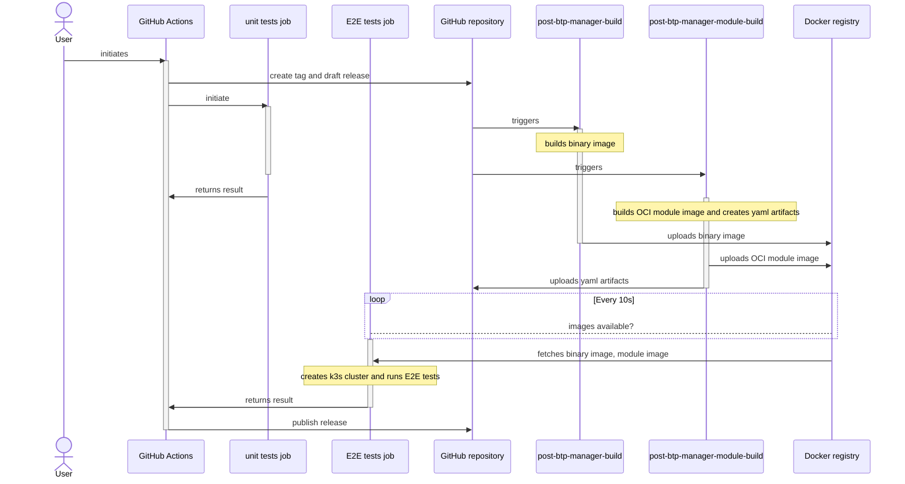

## Overview

The BTP Manager release pipeline creates proper artifacts:
 - btp-operator module OCI image in the [registry](https://console.cloud.google.com/artifacts/docker/kyma-project/europe/prod/btp-manager)
 - btp-manager Docker image in the [registry](http://europe-docker.pkg.dev/kyma-project/prod/unsigned/component-descriptors/kyma.project.io/module/btp-operator)
 - `template.yaml`, `template_control_plane.yaml`, `rendered.yaml`

## Run the pipeline

### Create a release
To create a release, follow these steps:

1. Run GitHub action **Create a release**: 
   1. go to the **Actions** tab
   2. click on **Create a release** workflow 
   3. click  **Run workflow** on the right
   4. provide a version, for example, 1.2.0.
   5. choose credentials for Service Manager, either "real" or "dummy" 
2. The GitHub action, defined in the `.github/workflows/create-release.yaml` file, creates a GitHub tag and draft release with the provided name.
3. The GitHub action asynchronously initiates unit tests and E2E test jobs.
4. The tag creation triggers Prow Jobs, `post-btp-manager-module-build` and `post-btp-manager-build`, defined in [btp-manager-build.yaml](https://github.com/kyma-project/test-infra/blob/main/prow/jobs/btp-manager/btp-manager-build.yaml).
5. `post-btp-manager-build` builds a Docker image tagged with the release name.
6. `post-btp-manager-module-build` runs the `kyma alpha create module` command, which creates a Kyma module, and pushes the image to the registry. 
Finally, the job uploads the `template.yaml`,`template_control_plane.yaml` and `rendered.yaml` files to the btp-manager release as release assets.
7. The GitHub action waits for the `template.yaml` asset in the GitHub release and for images in the Docker registry.
8. The GitHub action fetches the module image and runs E2E tests on the k3s cluster using specified credentials. 
9. If unit tests and E2E tests are completed successfully, GitHub action publishes the release.

### Replace an existing release

To regenerate an existing release, perform the following steps:

1. Delete the GitHub release.
2. Delete the GitHub tag.
3. Run the [**Create a release**](#create-a-release) pipeline. 
