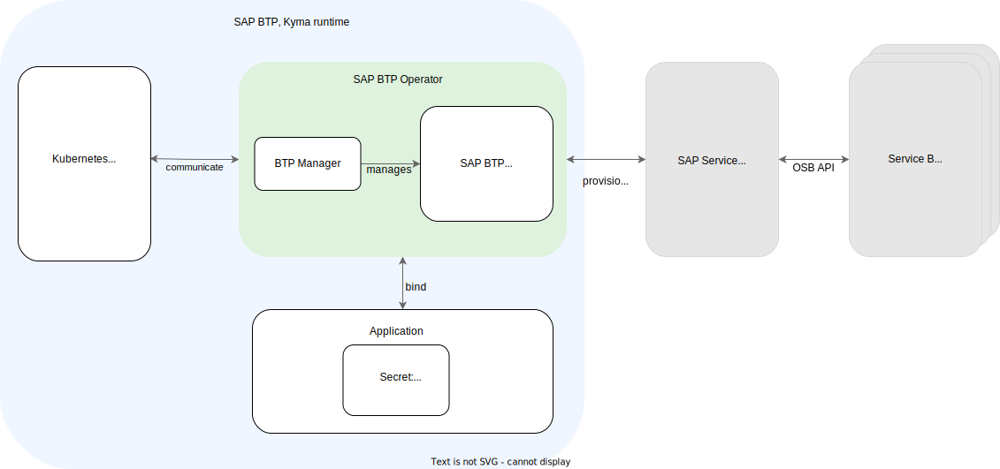

# SAP BTP Operator Module

Learn more about the SAP BTP Operator module. <!-- in HP?: The module is added to your Kyma cluster by default. --> Use it to enable Service Management and consume SAP BTP services from your Kyma cluster.

## What is SAP BTP Operator?

The SAP BTP Operator module provides Service Management, which allows you to consume [SAP BTP services](https://discovery-center.cloud.sap/protected/index.html#/viewServices) from your Kyma cluster using Kubernetes-native tools.
Within the SAP BTP Operator module, [BTP Manager](https://github.com/kyma-project/btp-manager) installs an open source component: the [SAP BTP service operator](https://github.com/SAP/sap-btp-service-operator/blob/main/README.md).
The SAP BTP service operator enables provisioning and managing service instances and service bindings of SAP BTP services so that your Kubernetes-native applications can access and use the services from your cluster.

## Features

The SAP BTP Operator module provides the following features:
* [Credentials and access preconfiguration](03-10-preconfigured-secret.md): Your Secret <!--shouldn't this be more specific?--> is readily available on Kyma runtime creation.
* [Multitenancy](03-30-multitenancy.md): You can configure multiple subaccounts in a single cluster.
* [Lifecycle management of service instances and service bindings](03-40-management-of-service-instances-and-bindings.md): You can create and delete service instances and service bindings.
* [Service binding rotation](03-50-service-binding-rotation.md): You can enhance security by automatically rotating the credentials associated with your service bindings.
* [Service binding Secret formatting](03-60-formatting-service-binding-secret.md): You can use different attributes in your ServiceBinding resource to generate different formats of your Secret resources.

## Scope

By default, the scope of the SAP BTP Operator module is your Kyma runtime, which consumes SAP BTP services from the subaccount in which you created it. You can extend the module's scope by adding more subaccounts and consuming services from them in one cluster. The scope can range from one to multiple subaccounts depending on the number of configured Secrets.

## Architecture

The SAP BTP Operator module allows for the initial provisioning and retrieving of credentials necessary for the application to use an SAP BTP service.

### SAP BTP, Kyma Runtime

SAP BTP, Kyma runtime runs on a Kubernetes cluster and wraps the SAP BTP Operator module, API server, and one or more applications. The application or multiple applications are the actual consumers of SAP BTP services.

### BTP Manager

BTP Manager is an operator based on the [Kubebuilder](https://github.com/kubernetes-sigs/kubebuilder) framework. It extends Kubernetes API by providing [BtpOperator Custom Resource Definition (CRD)](https://github.com/kyma-project/btp-manager/blob/main/config/crd/bases/operator.kyma-project.io_btpoperators.yaml). 
BTP Manager performs the following operations:
* Manages the lifecycle of the SAP BTP service operator, including provisioning of the latest version, updating, and deprovisioning
* Configures the SAP BTP service operator

### SAP BTP Service Operator

The SAP BTP service operator is an open-source component that allows you to connect SAP BTP services to your cluster and manage them using Kubernetes-native tools. It is responsible for communicating with SAP Service Manager. The operator's resources, service instances and service bindings, come from the `services.cloud.sap.com` API group.

### SAP Service Manager

[SAP Service Manager](https://help.sap.com/docs/service-manager/sap-service-manager/sap-service-manager?locale=en-US) is the central registry for service brokers and platforms in SAP BTP, which allows you to:
* Consume platform services in any connected runtime environment
* Track the creation and management of service instances
* Share services and service instances between different runtimes

SAP Service Manager uses [Open Service Broker API](https://www.openservicebrokerapi.org/) (OSB API) to communicate with service brokers.

### Service Brokers

Service brokers manage the lifecycle of services. SAP Service Manager interacts with service brokers using OSB API to provision and manage service instances and service bindings.

## API / Custom Resource Definitions

The `btpoperators.operator.kyma-project.io` Custom Resource Definition (CRD) describes the kind and the data format that SAP BTP Operator uses to configure resources.

See the documentation related to the BtpOperator custom resource (CR):
* [SAP BTP Operator](./resources/02-10-sap-btp-operator-cr.md)
* [Service instance](./resources/02-20-service-instance-cr.md)
* [Service binding](./resources/02-30-service-binding-cr.md)

## Resource Consumption

To learn more about the resources the SAP BTP Operator module uses, see [Kyma Modules' Sizing](https://help.sap.com/docs/btp/sap-business-technology-platform-internal/kyma-modules-sizing?locale=en-US&state=DRAFT&version=Internal#sap-btp-operator).
